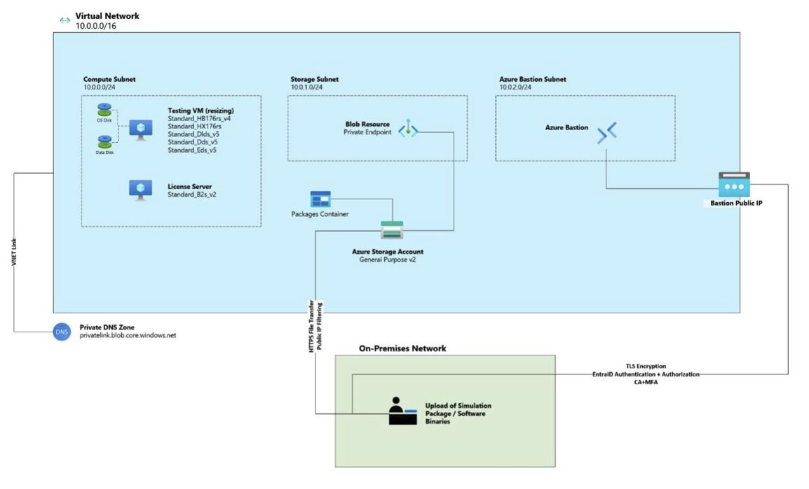

# Azure HPC PoC

   
Clone the repo to your local device by running:  git clone https://github.com/gamcmaho54/azurehpcpoc.git   
Modify the parameters.json to define your chosen Region, VM sizes and Trusted Source IP   
Deploy to Azure by running:  az deployment sub create --name hpcPocDeploy --location region --template-file main.bicep --parameters parameters.json   
Nb. Remember to  define your chosen region in the command above  
Nb2. The deployment should complete inside of 10 minutes
